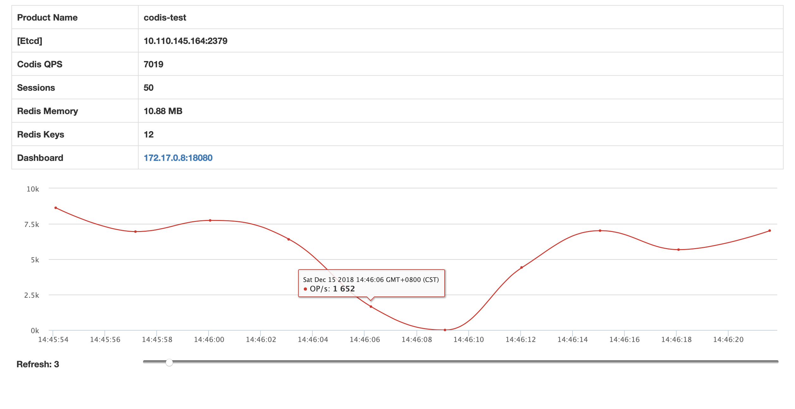
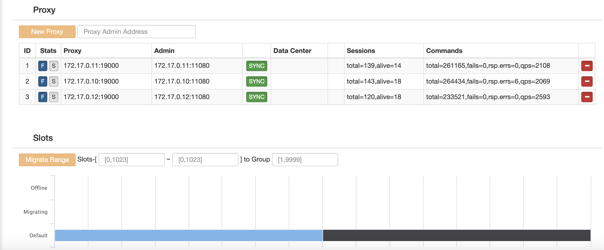
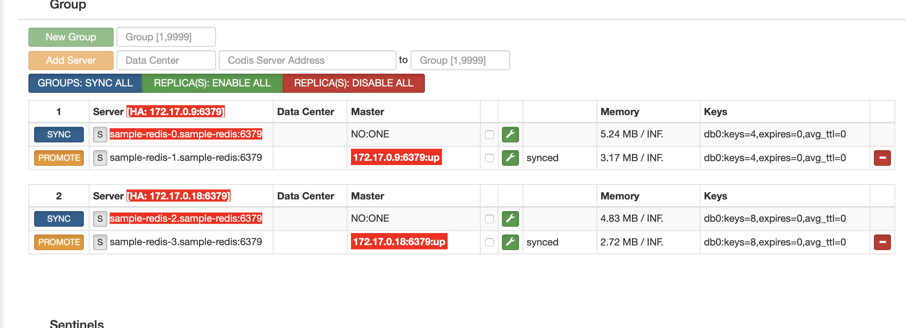

# Codis-Operator

Codis Operator creates and manages codis clusters running in kubernetes.(WIP)

## Advantages based on k8s

### NO SPOF RISK

Codis dashboard component which does migration/cluster management work is a spof, if it is deployed by traditional method and when it fails, we have to recover it manually,however,it will be self-healing based on k8s.

### Easily Create/Maintain Cluster

Codis Cluster has a lots of components(proxy/dashboard/redis/fe/sentinel).it will cost a lot of time if it is deployed and managed by traditional method,especially when nodes die,cut off,we have to recover/migrate every component manually.however,we can easily deploy/destory cluster with only one command based on k8s,and when proxy/dashboard/fe fails(node die,outage,node cut,node resource exhaustion),all these failures will be self-healing that saves much time.

## Feature

### Create and Destroy Codis Cluster

Deploy/Destroy cluster with only one comannd
	
### Scaling the Codis Cluster 

Automatically scales the proxy component

### Automatic FailOver

Automatically performs failover when proxy/dashboard/fe failed.

### Automatically monitoring Codis Cluster

Automatically deploy Prometheus,Grafana for Codis cluster monitoring.

## Getting Start(Demo)


### Deploy Codis Operator
	
```
kubectl create -f ./deploy/manager/deployment-dev.yml
```

### Create and destroy a codis cluster

```
kubectl create -f ./examples/sample-1.yml
```

```
kubectl delete -f ./examples/sample-1.yml
```

### SNAPSHOTS








