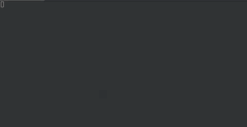

# Codis-Operator

Codis Operator creates and manages codis clusters running in kubernetes.(WIP)

## Feature

### Create and Destroy Codis Cluster

Deploy cluster with only one comannd
	
### Scaling the Codis Cluster 

Automatically scale the proxy component

### Automatic FailOver

Automatically performs failover when proxy/dashboard/fe failed.

### Automatically monitoring Codis Cluster

Automatically deploy Prometheus,Grafana for Codis cluster monitoring.

## Getting Start



### Deploy Codis Operator
	
```
kubectl create -f ./deploy/manager/deployment-dev.yml
```

### Create and destroy a codis cluster

```
kubectl create -f ./examples/sample-1.yml
```

```
kubectl delete -f ./examples/sample-1.yml
```


